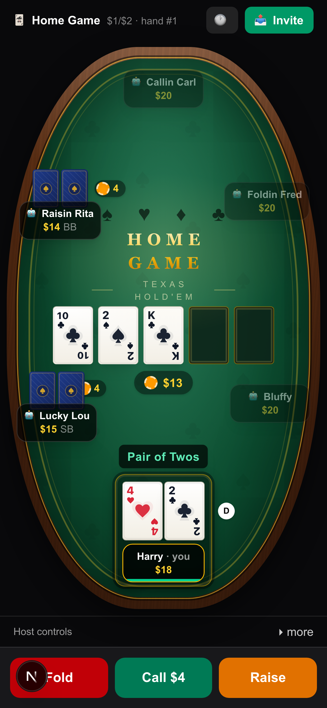
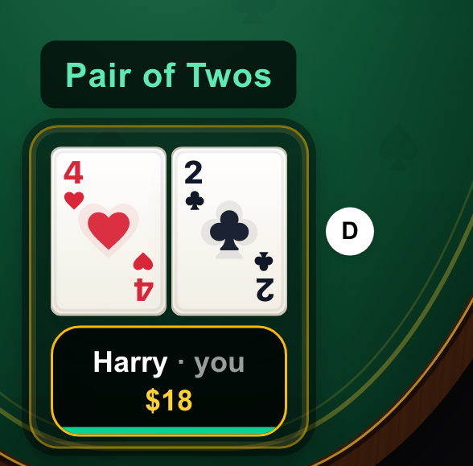
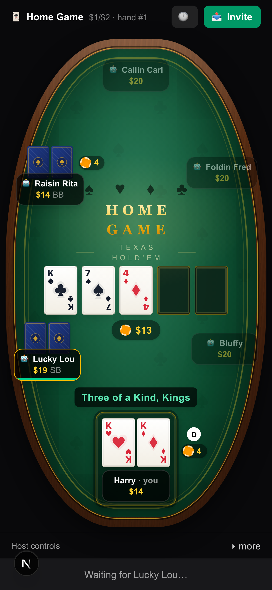
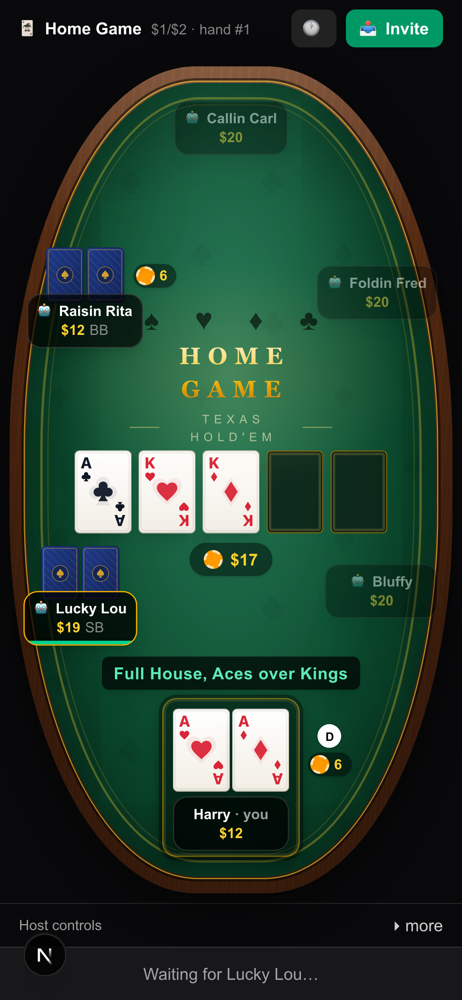

# 🃏 Home Game Poker

Texas Hold'em with friends — share a link, take a seat.

**Live:** https://home-game-poker-kappa.vercel.app

A polished, mobile-first multiplayer poker table with a hidden automated dealer. No accounts: the host creates a table, shares the link (native share sheet on phones), and approves who sits down. Everyone buys in with $1 coins, blinds post automatically, and a freshly CSPRNG-shuffled 52-card deck is dealt every hand. Play solo against 5 computer players with one click, or host a friends game with 0–5 bots filling the empty seats.

## Features

- **6-seat no-limit Texas Hold'em** with a correct rules engine: heads-up blinds, big-blind option, min-raise and short all-in rules, layered side pots with refunds, dead-button rotation, showdown order with auto-muck, odd-chip splits
- **NPC bots** with personalities (tightness / aggression / bluff frequency) that decide from a redacted view — structurally unable to cheat — and that defend properly against relentless betting
- **Top-ups (rebuys)**: off by default; the host can allow a decaying rebuy schedule. Off in quick play. A game-deciding bust holds the table briefly so the loser can re-enter when top-ups are enabled
- **Live hand labels**: as your hand develops, an emerald caption floats on the felt above your cards — "Pair of Twos", "Three of a Kind, Kings", "Full House, Aces over Kings" — like a casino video poker machine. Showdown winners get the same label in amber
- **Bot games end with you**: in a table of bots (quick play), the game is over the moment the last human busts with no re-buy left — you get the standings, not a bot-only spectator mode
- **Invite-link multiplayer**: name-only entry, host approval of seats, per-game signed httpOnly cookie identity — a refresh or dropped connection restores your seat; your name is remembered for the next game
- **Real-time** via Server-Sent Events with reconnect and mobile-background resync; sub-second updates
- **Turn timers** (20s + 10s time bank, host-configurable) with auto check/fold, away state, and "I'm back"
- **Host controls**: approve/deny seats, pause, kick, add/remove bots, end game (with final standings screen)
- **Guests can leave any time** — big Leave button; everyone else is notified
- Responsive: portrait-first phone layout and desktop oval table; animated cards, chips, pot, and winner banners

## Screenshots

Live gameplay on a phone. The wordmark sits with the board; your made hand is named on the felt above the cards; the dealer button and street bets sit beside the hole cards so a long caption never covers them.



| Pair of Twos | Three of a Kind, Kings | Full House, Aces over Kings |
| :---: | :---: | :---: |
|  |  |  |
| Hole 4♥ 2♣, flop T♣ 2♠ K♣. Facing $4. | Pocket kings, flop K♣ 7♠ 4♦. $4 out. | Pocket aces, flop A♣ K♥ K♦. $6 out. |

## Stack

Next.js (App Router, TypeScript, Tailwind v4) · Upstash Redis via Vercel Marketplace (atomic compare-and-set versioned state) · Motion (Framer Motion) · Vitest · deployed on Vercel (Node runtime / Fluid Compute).

## Development

```bash
npm install
npm run dev        # http://localhost:3000 — uses in-memory storage if no Redis env
npm test           # engine + server suite (incl. 150-game fuzz with chip-conservation invariants)
npm run lint
npx tsc --noEmit
```

For real-Redis local dev: `vercel env pull .env.local` (project must be linked with `vercel link`).

Required env in production: `SESSION_SECRET`, plus `KV_REST_API_URL` / `KV_REST_API_TOKEN` (auto-provisioned by the Upstash Marketplace integration).

## Deploy

Pushing `master` deploys production via Vercel’s GitHub integration. Confirm at https://home-game-poker-kappa.vercel.app.

If a Git deploy does not start, fall back to:

```bash
vercel deploy --prod
```

See `CLAUDE.md` for the architecture deep-dive and contributor notes.
